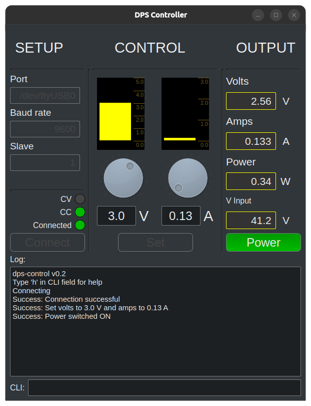

# dps-control
## DPS5005 Control Application

Simple application with GUI and CLI to control DPS5005 power supply unit. CLI version does not require X or graphical 
environment, you can use it in terminal-only hosts. The application has been developed and tested in *Linux* environment.
There should be no problem to run it on macOS and maybe even Windows is possible as the communication with DPS5005
device is handled by the simple minimalmodbus library.

## Configuration
### Requirements
The application has been tested with Python 3.11.9. It will run (probably) on any version where PySide6 dependency can 
be installed.

### General
Please check first `dps_control.cfg` file. It has very few settings but they are important as you need to tell the 
CLI in which tty port your DPS5005 device is and what its slave number is.  Configuration file also includes setting for used 
baud rate. It is *highly recommended* to use 9600 as other values may not work properly.

Also, please set the maximum voltage and current according to your power supply specs.

There is setting `start_power_off` which is True by default. This ensures that starting the dps-control application
first switches power off for safety reasons.

### Linux
In Ubuntu the port is usually `/dev/ttyUSB0`
or `/dev/ttyUSB1` or similar. If you do not know which port your device is in, you can plug it in and 
check `sudo dmesg` log which shows you where it mounted the device.

If you get permission errors about your tty port it might be that your user needs to be added to the `dialout` group.
`sudo usermod -aG dialout $(whoami)`

### macOS
TBD

### Windows
TBD

## Running

You can run the GUI in virtual python environment with script `./setup.sh` in Linux.

This will create `virtualenv` folder, install requirements there run the application. Once your environment is
set up correctly you can also run the application by

### GUI

`python main.py`

### CLI

`python main.py --cli`

## Usage

### GUI

The leftmost panel is for connectivity settings and status display. Connectivity fields are not editable in GUI, they 
should be set in `dps_control.cfg` configuration file before application launch. The middle panel is for controlling
the output values. You can either turn the dials, drag the bar display up or down or enter the desired value in
the edit box. However, the change is not committed to the DPS5005 device in real-time, you need to hit the *Set* button
to commit the values. Values cannot be set if there is no verified connection to the device.

On the right hand side panel the current output voltage, current and power are shown in addition on input voltage.

*Power* button switches DPS5005 output on or off. 

### CLI

Type `h` to get help, while there are very few commands available. You can control the voltage and current of the 
device by running commands:

`v 2.32` This will set the output voltage to 2.32 V

`a 4.23` This will set the output current to 4.23 A

`va 1.2 0.5` This will set the output voltage to 1.2 V and current to 0.5 A
 
You can toggle power output ON and OFF by `x` command.  
If you want to start live monitoring, you can use `l` command 
which shows you identical readings as you have on your DPS5005 device screen.

